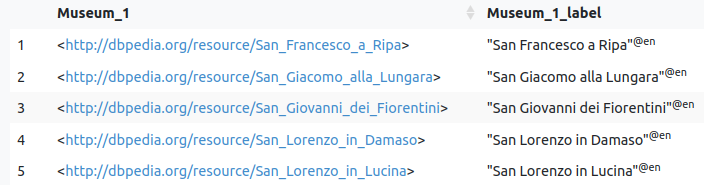
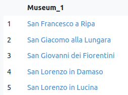
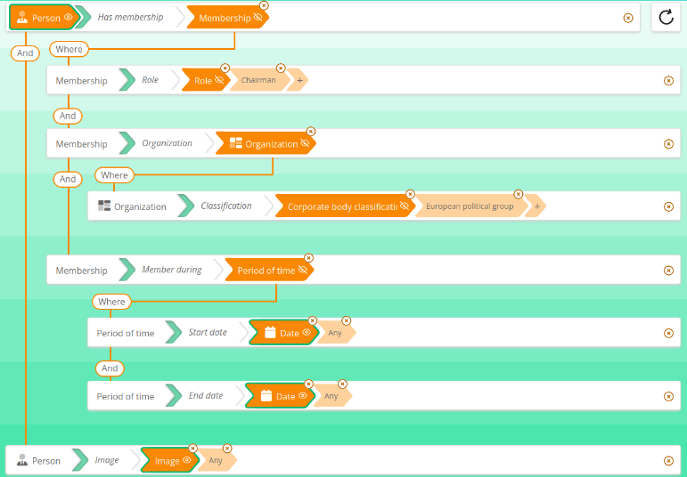
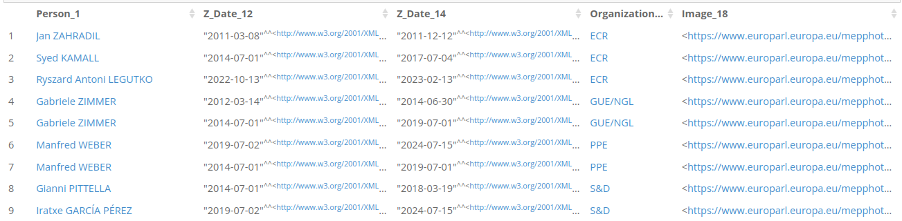
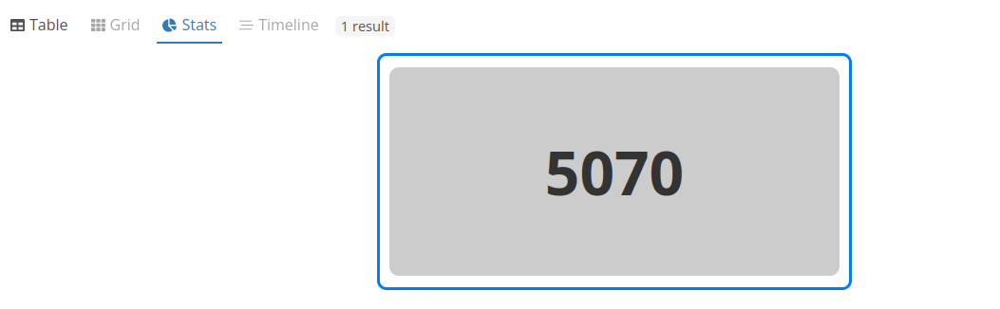
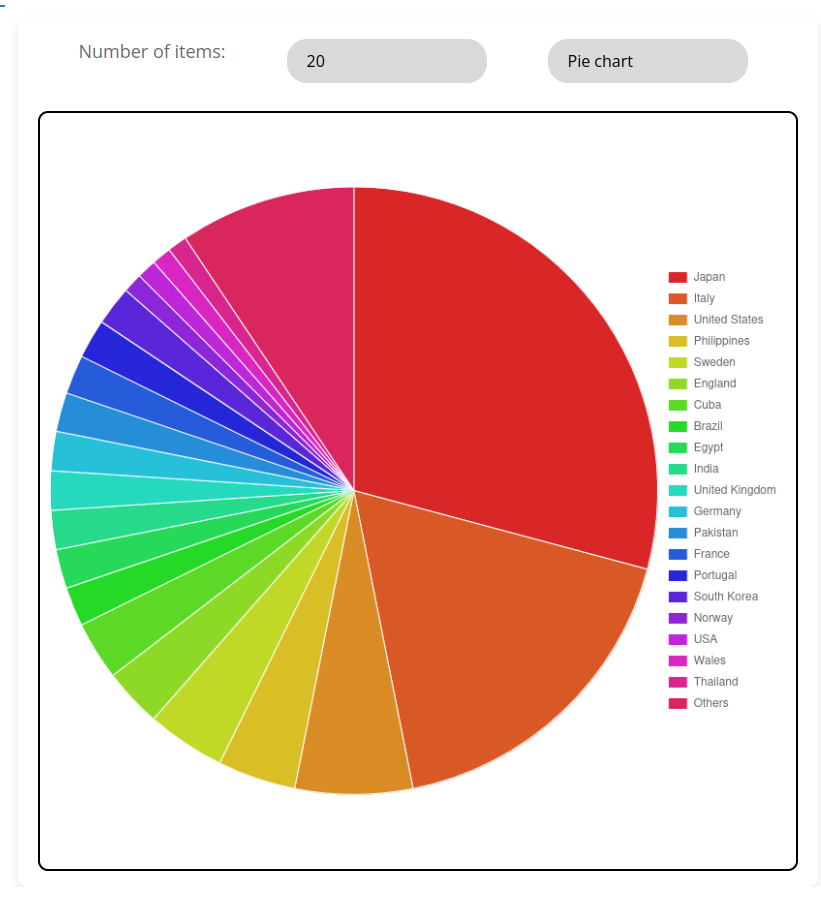
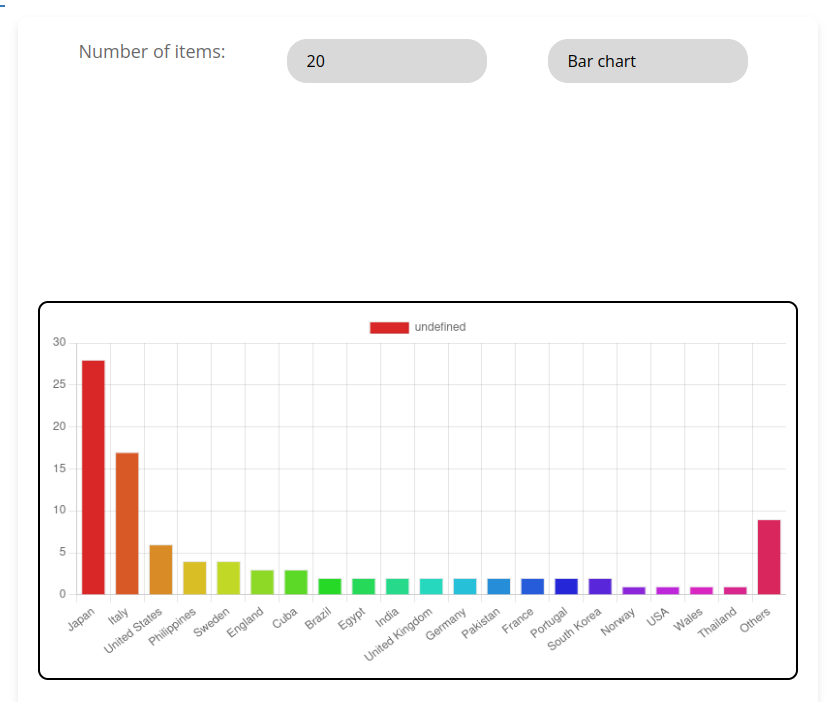
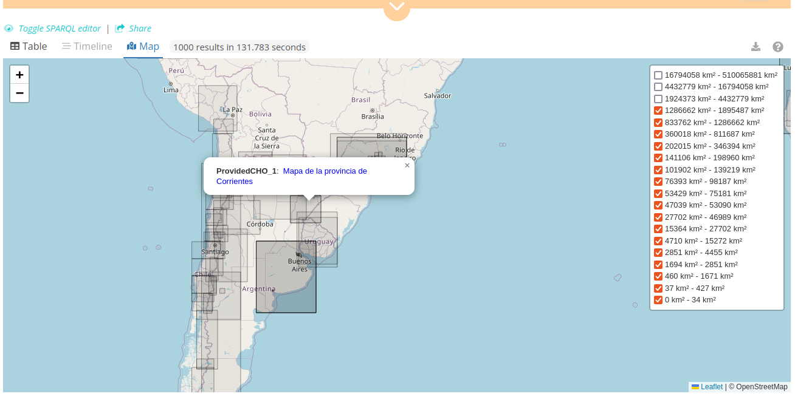

# Sparnatural-yasgui-plugins
Set of Plugins for Yasgui / YASR useful in conjunction with [Sparnatural](https://github.com/sparna-git/Sparnatural)

For integration with Sparnatural, there is a [dedicated documentation page](https://docs.sparnatural.eu/YasGUI-plugins.html)

## The Plugins

### TableX plugin

This is an adaptation of the original YaSR Table plugin. Its main enhancement is that it can hide URI columns "behind" a correspondig label column, thus hiding technical URIs for end-users. The link URLs can also be customzed to navigate to another URL than the original URI.

For every column `?xxx_label`, the plugin will look for a column `?xxx` having a literal property (for example `?Person_1` and `?Person_1_label`), and merge these columns. The merge is done on the SPARQL result set itself, by creating a new kind of result `x-labelled-uri` containing both the URI and its label. Only the `?xxx` column will be shown.

Instead of this:



You would get this:





### Grid plugin

The Grid plugin works only in conjunction with Sparnatural, not for any SPARQL query. It needs to be notified of the Sparnatural original query, and the Sparnatural original configuration.

The Grid plugin:
- looks for a main title column for each entity
- merges the lines in the result set with the same title
- displays the other columns in each card by replicating the original query structure from Sparnatural
- can look for an image column (containing URIs ending in `.png` or `.jpg`)

Here is how it looks like with an image column selected:


The original query was the following: (_All chairmans of EU political groups, with dates of chair and image_, based on the [European Parliament Open Data Portal](https://data.europarl.europa.eu/) datasets)



The original result set was the following - note how each person is duplicated as many times as it was a chairman of a group, with different dates:




Here is a focus on one card, note how the lines corresponding to the same entity have been merged, and how the original query structure is replicated inside the card:


### Stats plugin

The Stats plugin can:
- display a simple COUNT query, with only an integer result :



- generate simple pie or bar charts from a `COUNT` + `GROUP BY` query







### Map plugin

The map plugin:

- Reads columns with a datatype of `geo:wktLiteral`
- Can display Points and Polygons. MultiPolygons are currently not supported
- Displays the original query area coming from the query, if present
- Displays information bubbles by reading all columns from the result set
- Splits polygons into different layers according to their size, so that the user can reduce the number of polygons displayed on the map for clarity
- Can warn users if some lines in the result set do not have their coordinates filled int

Here is an exampe:



### Timeline plugin

TODO

### Integration in the page

#### Declaration with YasGUI / YasR

```html
<script type="text/javascript" src="./sparnatural-yasgui-plugins.js"></script>
```

```javascript
      Yasr.registerPlugin("TableX",SparnaturalYasguiPlugins.TableX);
      Yasr.registerPlugin("Grid",SparnaturalYasguiPlugins.GridPlugin);
      Yasr.registerPlugin("Stats",SparnaturalYasguiPlugins.StatsPlugin);
      Yasr.registerPlugin("Map",SparnaturalYasguiPlugins.MapPlugin);

      delete Yasr.plugins['table'];
      delete Yasr.plugins['response'];
      const yasr = new Yasr(document.getElementById("yasr"), {
        pluginOrder: ["TableX", "Grid", "Stats", "Map"],
        defaultPlugin: "TableX",
        // disable persistency
        persistencyExpire: 0,
        maxPersistentResponseSize: 0
      });

      if(lang == "fr") { 
        yasr.plugins["Grid"].config.lang = "fr";
        yasr.plugins["Stats"].config.lang = "fr";
      } else {
        yasr.plugins["Grid"].config.lang = "en";
        yasr.plugins["Stats"].config.lang = "en";
      }

      yasr.plugins["TableX"].config.uriHrefAdapter = function(uri) {
        if(uri.startsWith("http://fr.dbpedia.org/resource/")) {
          return "http://fr.wikipedia.org/wiki/" + uri.substring("http://fr.dbpedia.org/resource/".length);
        } else {
          return uri;
        }
      };

      // binds Sparnatural with the YasR plugins
      bindSparnaturalWithYasrPlugins(sparnatural, yasr);
```

#### Integration with Sparnatural

These plugins require a specific integration with Sparnatural to work. See the [Sparnatural documentation page](https://docs.sparnatural.eu/YasGUI-plugins.html). See the file `sparnatural-bindings.js` in Sparnatural releases.

#### API

These plugins have the following methods:

- `notifyQuery(query)` : expects the Sparnatural query structure, to be notified of the original query structure that was executed.
- `notifyConfig(specProvider)` : expects the Sparnatural configuration, to be aware of the labels and icons of the properties and classes in the config.

#### Configuration

##### TableX plugin

```typescript
export interface PluginConfig {
  openIriInNewWindow: boolean;
  tableConfig: DataTables.Settings;
  includeControls: boolean;
  uriHrefAdapter?: (uri: string) => string;
  bindingSetAdapter?: (binding: Parser.Binding) => Parser.Binding;
}
```

##### Grid plugin

```typescript
interface PluginConfig {
  lang: "en" | "fr";
}
```

##### Stats plugin

```typescript
interface PluginConfig {
  lang: "en" | "fr";
}
```

##### Map plugin

```typescript
interface PluginConfig {
    baseLayers: Array<{
        urlTemplate: string, 
        options?: L.TileLayerOptions
    }>
    polylineOptions: L.PolylineOptions | null,
    markerOptions: L.MarkerOptions | null,
    geoDataType: Array<string>,
    polygonDefaultColor: string,
    polygonColors: Array<string>,
    searchedPolygon: {
        fillColor: string,
        weight: number,
        opacity: number,
        color: string,
        dashArray: string,
        fillOpacity: number
    },
    mapSize: {
        width:string,
        height:string
    }
    setView: {
        center: L.LatLngExpression,
        zoom?: number,
        options?: L.ZoomPanOptions
    }
    parsingFunction: (literalValue:string)=> Geometry,
    L18n: {
        warnFindNoCoordinate: string, // use "<count>" pattern to replace with count of results with no geo coordinates
        warnFindNoCoordinateBtn: string // Link label for plugin table display on warnig message
    }   
}
```

## Developers

1. Clone the code
2. Install dependencies : `npm install`
3. Run dev server : `npm run start`
4. Adjust the code in the test page (index.html) to test and include the plugin
